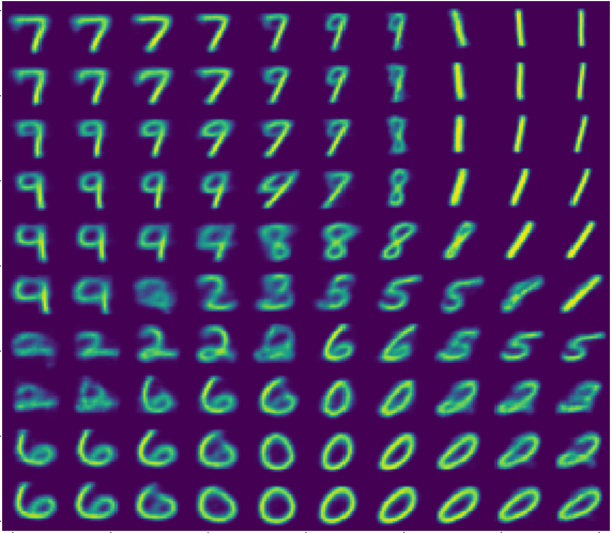
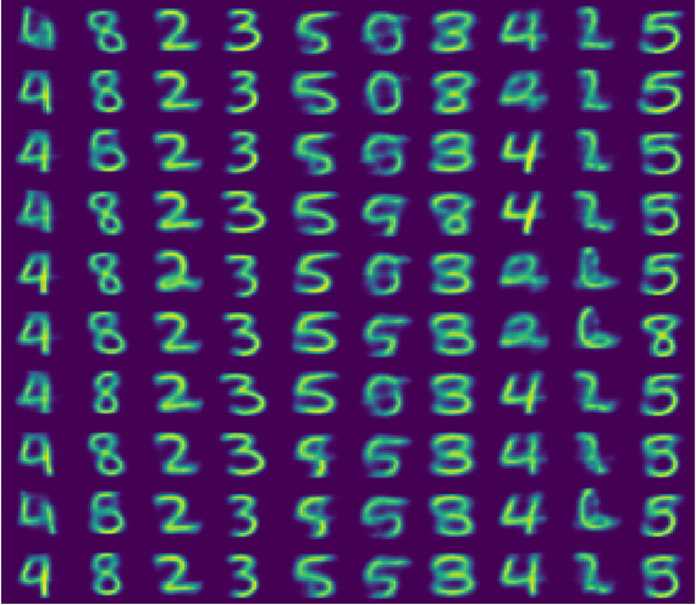

# Variational Auto Encoder with Concrete Latent Distribution
Keras implementation of a Variational Auto Encoder with a Concrete latent
distribution. See [Auto-Encoding Variational Bayes](https://arxiv.org/abs/1312.6114)
by Kingma and Welling and [The Concrete Distribution: A Continuous Relaxation of Discrete Random Variables](https://arxiv.org/abs/1611.00712) by Maddison, Mnih and Teh or [Categorical Reparameterization with Gumbel-Softmax](https://arxiv.org/abs/1611.01144) by Jang, Gu and Poole.

## Examples
Samples from a regular VAE



VAE with concrete latent distribution. Each column of the image corresponds to one of the categories of the latent concrete distribution.



## Usage
Traditional VAE with a 2 dimensional latent distribution
```python
>>>from vae_concrete import VAE
>>>model = VAE(latent_cont_dim=2)
>>>model.fit(x_train, num_epochs=20)
>>>model.plot()
```
You should see start seeing good results after ~5 epochs. The loss should approach ~140 upon convergence. Occasionally the optimization gets stuck in a poor local minimum and stays around ~205. In that case it is best to just restart the optimization.

VAE with 2 continuous variables and a 10 dimensional discrete distribution
```python
>>>model = VAE(latent_cont_dim=2, latent_disc_dim=10)
>>>model.fit(x_train, num_epochs=10)
>>>model.plot()
```
This takes ~10 epochs to start seeing good results. Loss should go down to ~125.

## Dependencies
- `keras`
- `tensorflow` (only tested on tensorflow backend)
- `plotly`

## Acknowledgements
Code was inspired by the [Keras VAE implementation](https://github.com/fchollet/keras/blob/master/examples/variational_autoencoder_deconv.py) (plotting functionality was also borrowed and modified from this example)
